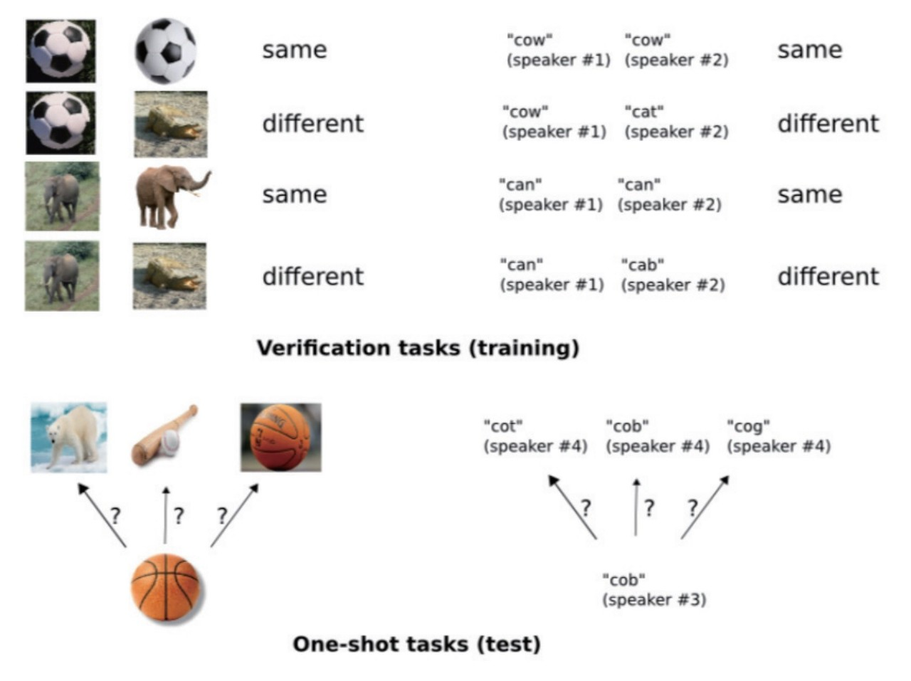

1. 메타학습: '학습하는 법을 학습한다'는 개념, AI에게 문제 해결에 필요한 학습 방법을 알려주는 기술. 관련된 수 많은 태스크를 학습하며 얻는 경험을 기반으로 새로운 태스크 학습 시 적은 데이터만으로 학습이 빠르게 이루어질 수 있게 한다.
   ● 분류기 ● 데이터 특징 추출 ● 학습 알고리즘 --> 보편적 인공지능 추구

# 기술동향

1. 메트릭 기반 메타학습
   메트릭 기반 메타학습은 데이커 간 유사도를 축정하는 메트릭(metric)을 학습해 퓨샷 문제를 해결한다. 퓨샷(few-shot)은 적은 데이터만으로 학습하는 것을 의미한다.
   예를 들어, 두 이미지의 중류 일치 여부를 판단하는 모델을 여러 번 학습시키면 하나의 훈련 이미지와 여러 이미지 종류가 같은지에 대해 한 번만에 비교가 가능해지는 식(원샷 문제 해결).
   

2. 그래디언트 기반 메타학습
   학습 알고리즘을 학습하기 위해 그래디언트 알고리즘의 초깃값을 메타하는 방법이다. 보통 초깃값은 임의의 값으로, 이는 사전 지식 없는 학습(Learning from scratch)에 해당한다. 2017년 ICML에 발표된 MAML(model-agnostic meta-learning) 모델이 그래디언트 기반 메타학습에 큰 영향을 줬다.

3. 확률모델 메타학습
   MAML과 같은 그래디언트 기반 메타학습 모델을 확장한 기술. 태스크의 모호함을 해결하고자 파라미터 불확실성을 다루는 능력과 확률모델의 장점이 메타학습에 적용된 것. 베이지안 모델을 기본으로 변분 추론(Variational Inference), 분할상환 추론(Amortized Inference) 방법이 주로 적용되는 추세

4. 온라인 메타학습
   실제 상황을 고려해 시간에 따라 순차적으로 학습이 진행되는 것. 기존 연구에서는 관련된 수많은 태스크가 한번에 주어진 상태에서 메타학습을 진행. 하지만 실제 적용 시 태스크는 하나씩 주어지기 때문에 학습이 연속으로 진행되야 한다. 이를 위해 온라인 메타학습에 대한 연구가 진행 중. 대표적으로 Online MAML, 이는 기존 MAML 모델을 온라인 학습 방식으로 확장 한 것.

# 시장동향

메타학습은 아직 초기 연구 단계. 현재는 학습과정에서 사용자의 개입을 최소화하는 역할을 하는 만큼 오토ML, 하이퍼변수 최적화(Hyperparameter Optimization), 신경 구조망 탐색(Neural Architecture Search; 인공지능 구조망 설계를 자동화하는 기술)에 가장 많이 응용 중.

특히 오토ML(자동 기계학습)을 적용한 ML 자동화 플랫폼이 대표적. 오토ML은 데이터 전처리 과정, 데이터로 특징 추출 방법, 알고리즘 선택, 하이퍼파라미터 최적화 등과 같이 사용자의 개입을 없애고 오직 데이터만으로 ML을 자동화 하는 기술. 구글 클라우드 오토ML(Cloud AutoML), 아마존 세이지메이커(SageMaker)가 대표적.

국내 IT 기업에서도 이런 자동화 플랫폼에 기반한 다양한 연구가 진행중. 카카오브레인 연구팀에선s 'Fast AutoAugment'를 제안. 이는 데이터 어그멘테이션(Data Augmentation) 자동화 알고리즘에 관한 연구를 통해 구글이 발표한 대표적인 선행연구인 'AutoAugment'을 개선한 것. 데이터 어그멘테이션은 DL 학습에 필요한 대량 데이터 확보 전략 중 하나로, 적은 데이터만으로도 데이터양을 자가증식하는 방법론이다.
