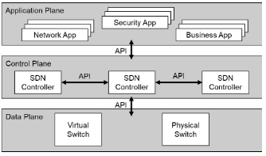
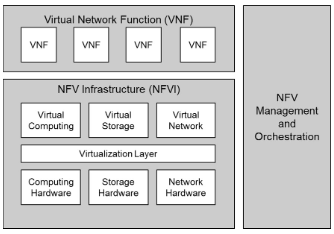
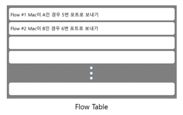
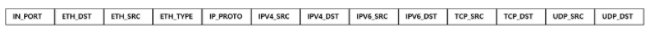
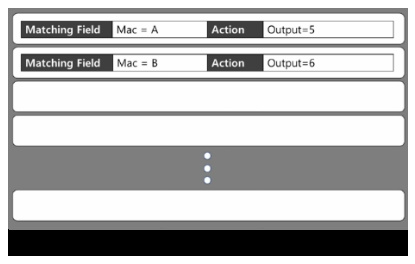

1. 패킷 : 컴퓨터 네트워크가 전달하는 데이터의 형식화된 블록이다. 패킷은 제어 정보와 사용자 데이터로 이루어지며, 이는 페이로드라고도 한다. 데이커가 패킷으로 형식이 바뀔 때, 네트워크는 장문 메시지를 더 효과적이고 신뢰성 있게 보낼 수 있다.

2. 제어 평면 : 패킷 전달 경로를 결정하는 과정을 담당하는 부분, 장비를 Control하는 Plane

3. 데이터 평면 : 실제 패킷 전송을 담당하는 부분, 데이터(패킷)를 처리하는 Plane

4. SDN(Software Defined Networking) : 데이터 평면과 제어 평면을 분리하여 네트워크 장비에는 데이터 평면만 남겨 패킷의 전달에만 집중하도록하고, 제어 평면은 외부 서버와 같은 중앙 컨트롤러로 옮겨 패킷의 경로 결정만 담당하도록 하는 기술이다.

   

이 때 분리된 평면 간의 통신을 위해 오픈소스 API를 사용한다. [그림참조]

SDN은 네트워크 장비에서 경로 결정 기능을 제거하였기 때문에 각 네트워크 장비의 부하가 감소하게 되고, 중앙 컨트롤러가 전체 네트워크의 정책을 결정하기 때문에 전체 네트워크에 동시에 같은 정책을 적용할 수 있어 네트워크 제어가 간편해진다는 장점이 있다. 또한 오픈소스 API의 사용으로 네트워크 장비 회사에 대한 의존성이 줄어들고 다양한 네트워크 소프트웨어 개발 및 이용이 가능하게 된다.

5. NFV(Network Function Virtualization) : NFV는 그림과 같이 네트워크 기능을 클라우드 등의 VM에 소프트웨어적으로 구현하는 기술.

   

NFV는 전통적 네트워크와 달리 하드웨어의 구입 없이 사용자가 원하는 때에 원하는 네트워크 기능을 만들어서 사용할 수 있기 때문에 네트워크 상황이 변화하여 새로운 기능이 요구되어도 유연하게 대응 할 수 있다. 또한 VM 위에 구현한 네트워크 기능은 여러 사용자들이 공유하여 사용할 수 있고, 필요하지 않게 되면 언제든지 삭제가 가능하기 떄문에 자원의 활용 측면에서 효율적이다.
다시 말해 스위치나 라우터 등의 물리적 네트워크 장비 기능을 가상화하여 VM이나 Container, 또는 범용 프로세서를 탑재한 하드웨어에서 구동하는 방식. 이를 통해 소프트웨어적으로 라우팅, 병화벽, 로드밸런싱, WAN가속, 암호화 등의 네트워크 기능을 구현하거나 네트워크 상의 다양한 위치로 이동 가능.

6. ISP(Internet Service Provider) : 인터넷에 접속하는 수단을 제공하는 주체, 일반적으로 인터넷에서 이용 가능한 모든 것에 대한 접근권을 사용자에게 부여하는 엑세스 포인트나 게이트웨이 역할을 한다.

7. IDC(Internet Data Center) : 인터넷 연결의 핵심이 되는 서버를 한 데 모아 집중시킬 필요가 있을 때 설립하는 시설. IDC를 통해 온라인 게임의 운영에 필요한 서버 컴퓨터와 네트워크 회선 등을 제공하는데, 다른 말로는 서버 호텔이라고도 부른다.

8. Enterprise Networking : 일반적으로 LAN 생성에 흔히 사용되는 하드웨어 스위치, 라우터 디바이스, 이더넷 케이블 연결, Wi-Fi 연결 및 통합 방화벽 소프트웨어가 포함된 LAN 표준을 중심으로 함.

9. openflow : 네트워크를 경유하는 네트워크 스위치나 라우터의 포워딩 플레인에 접근 권한을 제공하는 통신 프로토콜. 오픈플로는 네트워크 컨트롤러가 스위치망을 통해 네트워크 패킷의 경로를 정의할 수 있게 한다. 컨트롤러는 스위치와는 구별한다. 오픈플로 프로토콜은 전송 제어 프로토콜(TCP) 위에 계층화되며, 전송 계층 보안(TLS)의 이용을 규정한다. 컨트롤러는 연결 설정을 하려는 스위치에 대하여 TCP 포트 6653을 리스닝하고 있어야 한다.

10. topology : 컴퓨터 네트워크의 요소들(링크, 노드 등) 물리적으로 연결해 놓은 것, 또는 그 연결방식을 말한다. 로컬 영역 네트워크(LAN)은 물리적 토폴로지와 논리적 토폴로지 둘다 보여 줄 수 있는 네트워크의 한 예이다. 랜 상의 어떠한 노드도 네트워크 상에서 하나 이상의 다른 노드에 하나 이상 링크를 갖고 있으며 그래프 상의 이러한 링크와 노드들은 네트워크의 물리적 토폴로지를 잘 설명한다. 이와 비슷하게 네트워크 상에서 노드끼리의 데이터 흐름은 네트워크의 논리적 토폴로지를 결정한다. 몰리적 토폴로지와 논리적 토폴로지는 특정 네트워크에서 아주 동일 할 수도, 그렇지 않을 수도 있다.

11. mininet

12. OVS

13. DPID : SDN Switch 식별자

14. Legacy장비 : 기존 네트워크 장비

15. Flow : 패킷을 처리해주는 규칙의 단위
    ex) 하나의 SDN Switch에서 Mac이 A인 패킷을 5번 포트로 보내고 싶다면 하나의 Flow가 생성된다. 다음으로 Mac이 B인 패킷을 6번 포트로 보내고 싶다면 또 하나의 Flow가 생성된다.
    이렇게 생성된 Flow들은 스위치의 Flow Table에 저장된다.
    
    Flow는 Matching Field와 Action을 지정하여 생성하게 된다.
    Matching Field에 들어갈 수 있는 내용은 다음 그림과 같다.
    
    Action에 들어갈 수 있는 내용은 Drop 또는 특정 포트로 포워딩, 다른 테이블로 전달 등이 있다.
    위의 Flow Table 그림을 Matching Field와 Action으로 쓴다면 아래와 같다.
    

16. 제로 트러스트 : 엄격한 ID 확인 프로세스를 기반으로 하는 네트워크 보안 모델. 이 프레임워크는 인증되고 권한이 부여된 사용자와 디바이스만 애플리케이션 및 데이터에 접속하도록 허용. 동시에 인터넷의 위협으로부터 애플리케이션과 사용자를 보호.
